# 🚀 Azure End-to-End Data Engineering Project

> **End-to-End Azure Data Engineering Pipeline using Azure Data Factory, Azure Data Lake Storage Gen2, Azure Databricks, Azure Synapse Analytics and Power BI**

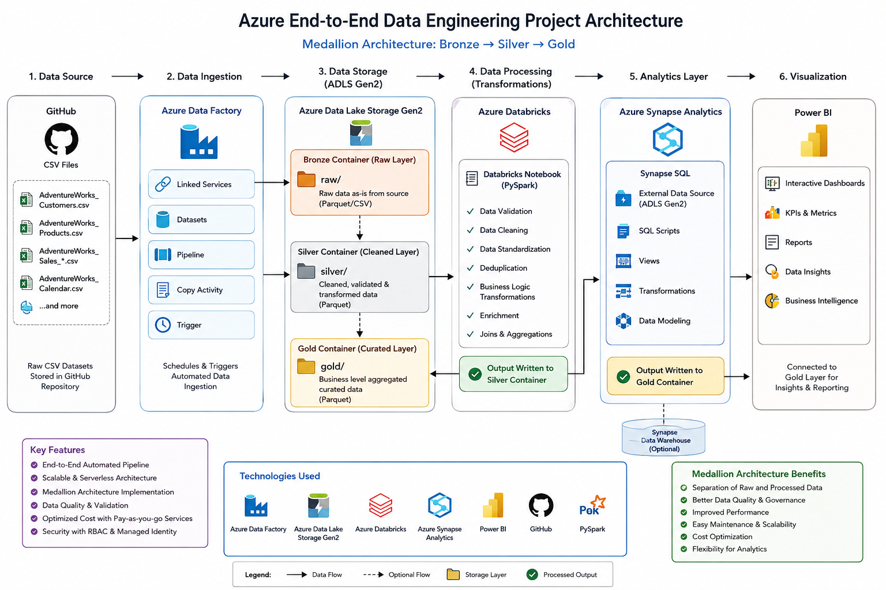

---

## 📌 Project Overview

This project demonstrates a complete Azure Data Engineering solution built using the **Medallion Architecture (Bronze → Silver → Gold)**.

The pipeline ingests AdventureWorks CSV datasets from GitHub using Azure Data Factory, stores raw data in Azure Data Lake Storage Gen2, performs data cleansing and transformation with Azure Databricks (PySpark), creates analytical views in Azure Synapse Analytics, and visualizes business insights using Power BI.

---

# 🏗️ Architecture

```text
GitHub CSV
      │
      ▼
Azure Data Factory
      │
      ▼
Bronze (ADLS Gen2)
      │
      ▼
Azure Databricks (PySpark)
      │
      ▼
Silver (ADLS Gen2)
      │
      ▼
Azure Synapse Analytics
      │
      ▼
Gold Layer
      │
      ▼
Power BI Dashboard
```

---

# 🛠️ Technology Stack

| Service | Purpose |
|---------|---------|
| Azure Data Factory | Data Ingestion |
| ADLS Gen2 | Data Lake Storage |
| Azure Databricks | Data Transformation |
| PySpark | ETL Logic |
| Azure Synapse Analytics | SQL & Analytics |
| Power BI | Dashboard & Reporting |
| GitHub | Dataset Source |

---

# 📂 Repository Structure

```text
Azure-End-to-End-Data-Engineering-Project
│
├── datasets
├── notebooks
├── sql
├── screenshots
├── architecture
├── README.md
├── LICENSE
├── .gitignore
└── requirements.txt
```

---

# 🔄 Pipeline Flow

1. GitHub hosts AdventureWorks CSV datasets.
2. Azure Data Factory copies files into the Bronze container.
3. Azure Databricks notebook performs PySpark transformations.
4. Cleaned data is stored in the Silver container.
5. Azure Synapse SQL creates external tables and Gold views.
6. Curated Gold data is consumed by Power BI dashboards.

---

# 📸 Project Walkthrough

## Resource Setup
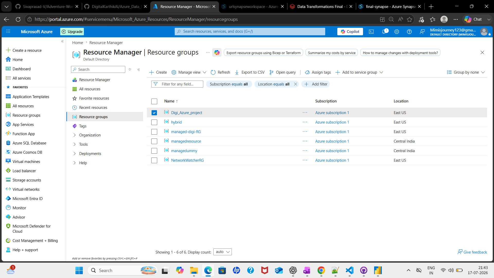

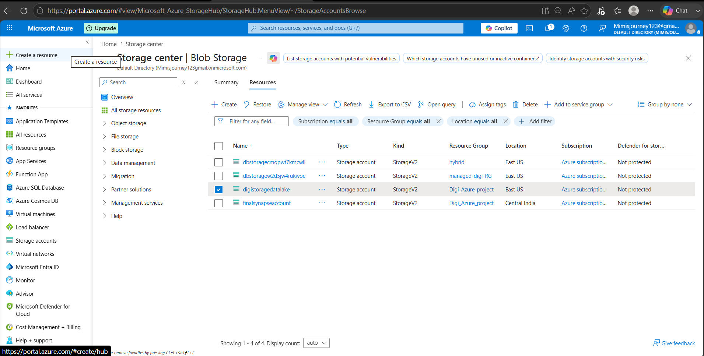

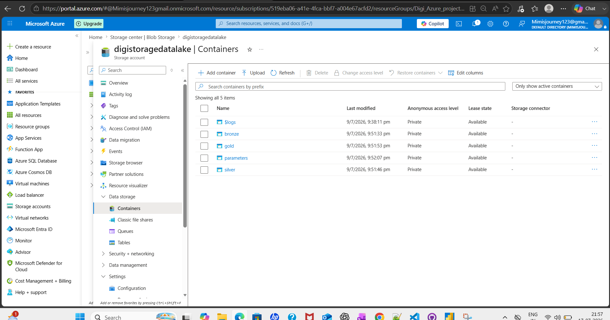

## Azure Data Factory
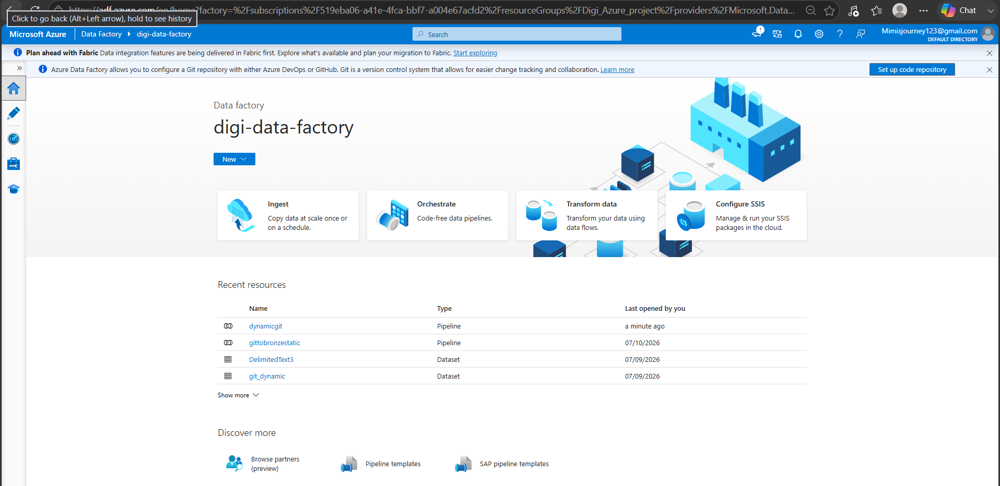

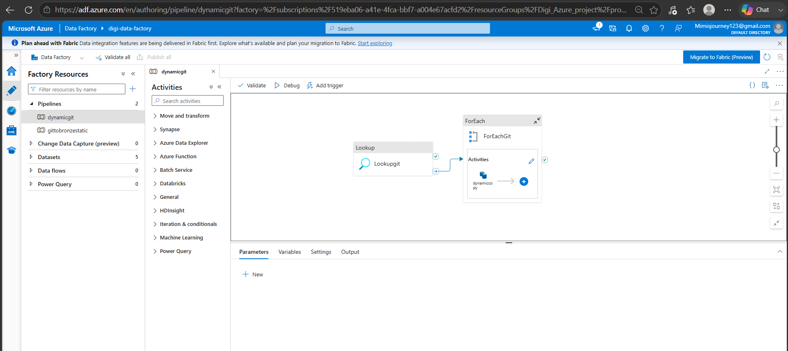

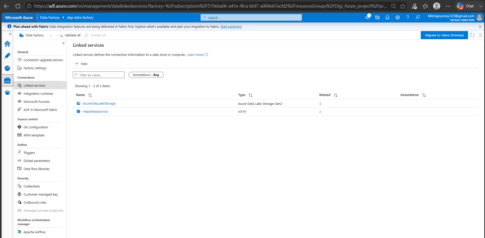

## Azure Databricks
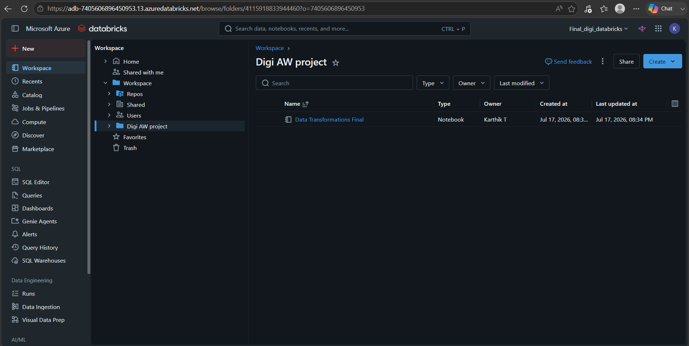

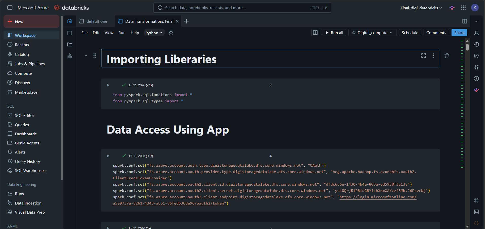

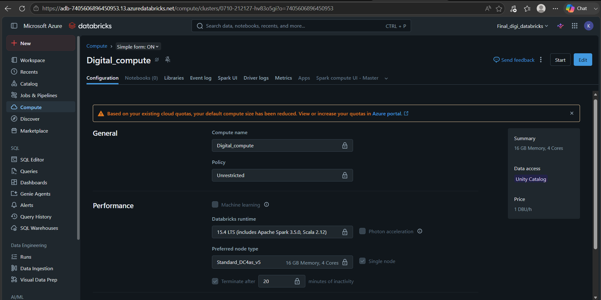

## Azure Synapse
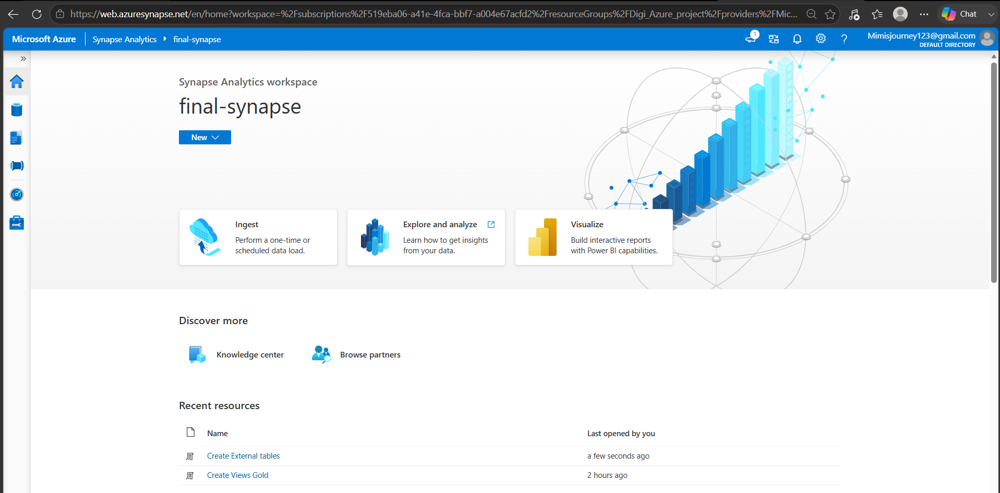

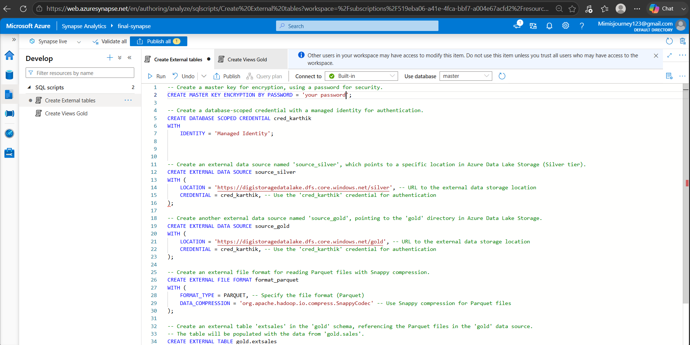

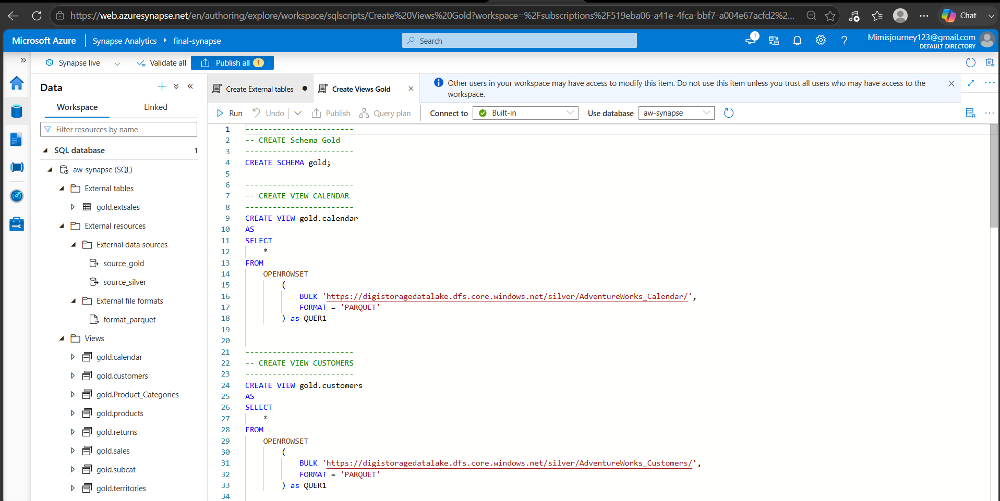

## Data Lake Layers
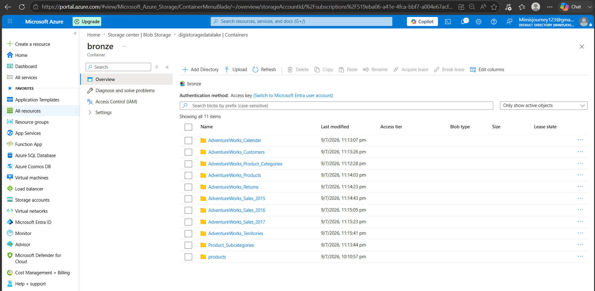

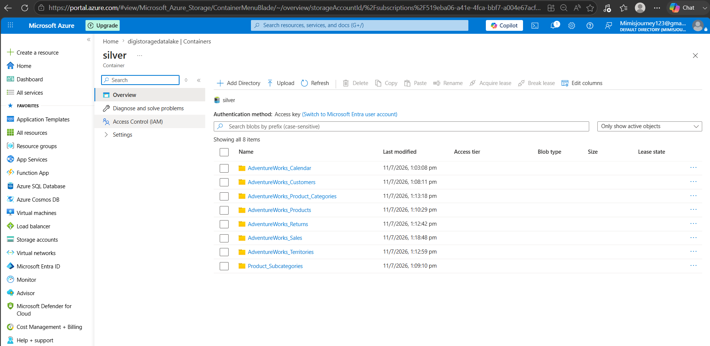

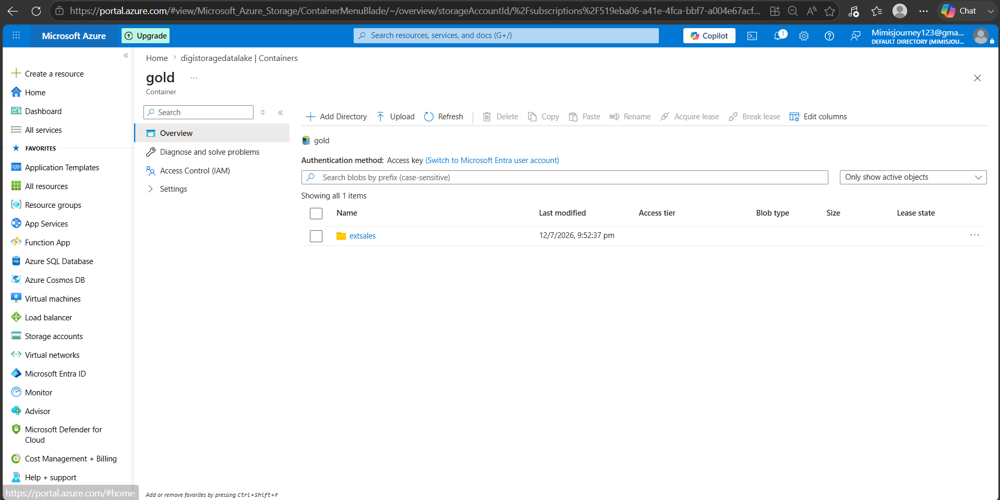

## Dashboard
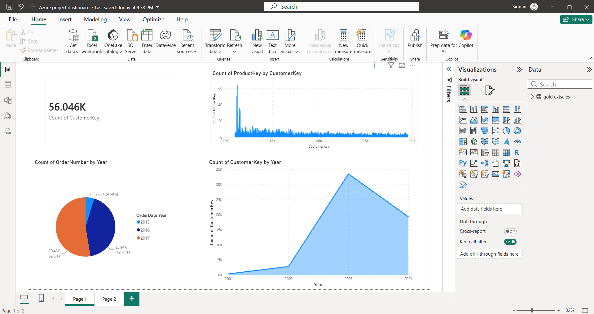

---

# ⭐ Features

- End-to-End Azure Data Pipeline
- Medallion Architecture
- Automated Data Ingestion
- PySpark Transformations
- Synapse SQL Analytics
- Interactive Power BI Dashboard

---

# 🧩 Challenges Solved

- Azure Databricks workspace provisioning
- Service Principal authentication
- RBAC permissions for ADLS Gen2
- AuthorizationPermissionMismatch resolution
- Azure Synapse integration
- Bronze → Silver → Gold implementation

---

# 📈 Results

- ✅ Automated pipeline
- ✅ Bronze, Silver & Gold layers created
- ✅ Synapse analytical layer
- ✅ Power BI dashboard
- ✅ Enterprise-style Azure architecture

---

# 🚀 Future Enhancements

- CI/CD using GitHub Actions
- Terraform deployment
- Data Quality checks
- Azure Monitor integration

---

# 👨‍💻 Author

**Karthik**  
Data Engineer  
Bangalore, India

GitHub: https://github.com/DigitalKarthikAI

If you found this project useful, consider giving it a ⭐.
